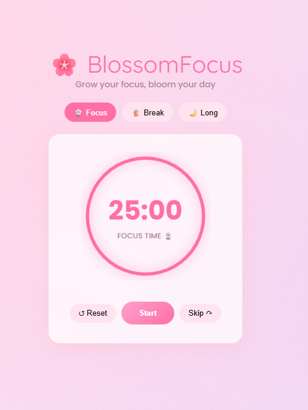

# FocusPulse 🌸

**FocusPulse** (a.k.a. *BlossomFocus*) is a lightweight web-based productivity timer inspired by the Pomodoro Technique. It helps you structure your work sessions with dedicated focus time and refreshing breaks.


---

## 🚀 Features

- **Focus / Short break / Long break modes** with one-click switching.
- **Animated progress ring** and countdown timer.
- **Session tracking** with dots for completed focus rounds.
- Simple **reset / start / skip** controls.
- No backend required — works entirely in the browser.

---

## ▶️ Running locally

1. Clone the repo (if you haven't already):

   ```bash
   git clone https://github.com/Bhumimahajan01/FocusPulse.git
   cd FocusPulse
   ```

2. Open `index.html` in your browser:

   - Double-click `index.html`

---

## 🛠️ Project structure

- `index.html` — app UI and layout
- `style.css` — styling and animations
- `script.js` — timer logic and interactions

---

## 💡 Customize

- Adjust work/break durations in `script.js`
- Tweak colors/motion in `style.css`

---

## 📄 License

This project is open source. Feel free to reuse and adapt it.
